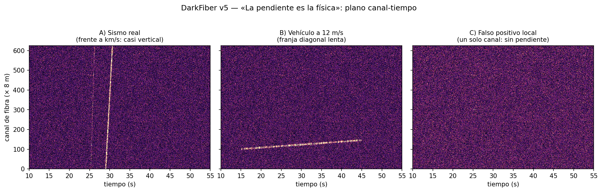

<p align="right"><a href="README.es.md">Español</a></p>

# darkfiber

[](https://github.com/Sirkraven/darkfiber/actions/workflows/ci.yml)
[](LICENSE)
[](pyproject.toml)

**A physics-first coherence engine for Distributed Acoustic Sensing (DAS).**
In the channel-time plane, an event's *slope* is its physics: a real
earthquake crosses the array at km/s (near-vertical moveout), a vehicle at
~2-40 m/s (a slow diagonal streak), and a single-channel transient has no
slope at all. This measures that slope instead of asking a per-channel
classifier to guess.

<p align="center">
  
</p>

## Quickstart

```bash
pip install -e ".[figs]"
python -m darkfiber.run_validation --figs   # 5 synthetic scenarios, 12/12 checks, ~15s
```

## Results — real data, not just synthetic

Every real-data verdict below is cross-checked against an independent
source (USGS origin time, or the ground truth embedded in the
[QuakeFlow DAS](https://huggingface.co/datasets/AI4EPS/quakeflow_das)
dataset) — not just against this repository's own synthetic scenarios.

| Event | Array | Magnitude | Verdict | Outcome |
|---|---|---|---|---|
| East Foothills, 2017-10-10 | Stanford-1 Campus | M4.1 | `SISMO_CONFIRMADO` | **HIT** — 2.8s before the USGS origin time |
| Pawnee, OK (teleseism), 2016-09-03 | Stanford-1 Campus | M5.8 | `COHERENTE_DESCONOCIDO` | correctly *not* over-confirmed — a teleseism's emergent arrival isn't a local moveout |
| Ridgecrest, 2020-06-24 | Ridgecrest North | M2.67 | `COHERENTE_DESCONOCIDO` | weak signal, correctly not over-confirmed |
| Ridgecrest, 2020-06-24 | Ridgecrest North | M5.8 | `POSIBLE_REGIONAL_EMERGENTE` | correctly escalated, not suppressed — [was a real bug](CHANGELOG.md), fixed in 1.0.0 |

Full write-up, including how each of these was found and cross-checked:
[`validacion_real/NOTES.md`](validacion_real/NOTES.md). Live scoreboard
(regenerates from the ledger): [`validacion_real/scoreboard.md`](validacion_real/scoreboard.md).

Synthetic validation (known ground truth, `python -m darkfiber.run_validation --figs`):
**12/12 checks**, including a scenario built specifically to reproduce the
regional-emergent bug above (`E_regional_emergente`) so it can't regress
silently.

## Honesty box — read this before trusting a number above

**What's actually validated:** 4 real events across 2 arrays (Stanford-1
Campus, Ridgecrest North), each cross-checked against an independent
ground-truth source. That is a small sample. The infrastructure to grow it
(`run_on_quakeflow.py`, the ledger, the scoreboard) supports dozens of
events across the three arrays QuakeFlow DAS makes available (Arcata,
Monterey Bay, Ridgecrest) — the sample size, not the tooling, is today's
limit.

**Known limit — aperture vs. distance:** a real, strong earthquake can be
simultaneously "too far/emergent for this array to measure a velocity" and
"not a false positive". [`docs/adr/0002`](docs/adr/0002-regional-emergent-class.md)
and [`characterize_aperture.py`](src/darkfiber/characterize_aperture.py)
document this with two synthetic sweeps; for a ~9 km aperture (Ridgecrest
North), semblance-based velocity measurement degrades well before the
naive geometric sampling limit would predict. Don't extrapolate this
system's confirmed-earthquake behavior to arrays much shorter than the
ones validated here without re-running that characterization.

**Conscious debt — selection bias:** the 4 real events above were not a
blind random sample. Each was found by searching USGS/QuakeFlow for a
plausible candidate (magnitude, distance, data availability), which biases
toward events likely to produce a clean result. The regional-emergent M5.8
case is the counter-example that kept this honest — it was *not* the
result the search was aiming for — but the base rate of "how often does
this system get it right on an unselected real event" is not yet known.
Growing the ledger with an unfiltered batch (not hand-picked for a good
story) is the next real step, not a polish item.

**Recall is a scalar today, should be a curve.** `recall_gauge()` reports
detection rate from 5 synthetic injections. See
[`docs/adr/0007`](docs/adr/0007-recall-as-curve-not-scalar.md) for why a
recall-vs-SNR curve with confidence intervals is the right target and why
a 5-sample scalar shouldn't be over-read.

## Architecture

```
raw array (channels × time)
        │
        ▼
  Tier 0 — triage.py            STA/LTA, vectorized (cumsum), whole matrix at once
        │  99.98% of silence never reaches anything downstream
        ▼
  Tier 1 — batching.py          async micro-batching for ML inference (optional, ONNX)
        │
        ▼
  Tier 2 — coherence.py         slant-stack semblance, coincidence, trajectory
        │                       regression → CoherenceAgent.analyze()
        ▼
  EventClass ── SISMO_CONFIRMADO / FUENTE_MOVIL_TRAFICO / POSIBLE_REGIONAL_EMERGENTE
             └─ COHERENTE_DESCONOCIDO / INCOHERENTE_LOCAL_SUPRIMIDO
        │
        ▼
  catalog.py (unknown → recurring → named, per array_id)
  run_on_quakeflow.py → ledger → calibrate.py (propose, human applies)
```

## Modules

| File | What it does |
|---|---|
| `contracts.py` | Pydantic v2 contracts: configs, `TriggerEvent`, `CoherenceResult` with auditable `explanations` |
| `triage.py` | **Tier 0**: exact vectorized STA/LTA (cumsum, delayed LTA) over the whole matrix |
| `coherence.py` | **Tier 2**: slant-stack/semblance, coincidence, moving-source tracking, stacked beam, P/S picking |
| `batching.py` | **Tier 1**: `AsyncMicroBatcher` for batched ONNX inference (max 64 / 20 ms) |
| `catalog.py` | Live signature catalog (SQLite): recurring unknowns → promoted to a named class without retraining; also the P2 ledger and P3 array profiles/proposals |
| `selftest.py` | Synthetic injection over live/real buffers + recall gauge |
| `synth.py` | Physically-correct synthetic scenario builders |
| `run_validation.py` | Reproduces every number in the table above (`--figs` for figures) |
| `run_on_stanford.py` | CLI adapter for real Stanford H5/NPZ |
| `convert_stanford_sgy.py` | Real Stanford SEG-Y (PubDAS / `FiberOpticEarthquakes`) → NPZ |
| `run_on_quakeflow.py` | Validation harness against QuakeFlow DAS, ledger-backed |
| `characterize_aperture.py` | The aperture/distance limit, characterized with two synthetic sweeps |
| `calibrate.py` | Proposes threshold adjustments with evidence; never applies silently |
| `interferometry.py` | Virtual-source interferometry from discarded traffic noise — `--demo` validates against known ground truth |

## Data

This repository never ships DAS data. To run against real events:

```bash
pip install huggingface_hub hf_xet
python -c "from huggingface_hub import hf_hub_download; \
  hf_hub_download('AI4EPS/quakeflow_das', 'ridgecrest_north/data/<event_id>.h5', repo_type='dataset')"
python -m darkfiber.run_on_quakeflow --dir <folder> --array-id ridgecrest_north
```

See [`validacion_real/NOTES.md`](validacion_real/NOTES.md) for the
Stanford SEG-Y path (PubDAS via Globus) as an alternative source, and for
the gotchas found while using both (sampling rate is not constant across a
deployment's lifetime — always read it from the file header, never assume
it).

## How to cite

See [`CITATION.cff`](CITATION.cff).

## Contributing

See [`CONTRIBUTING.md`](CONTRIBUTING.md) and [`docs/adr/`](docs/adr/) for
the decisions behind the design.

## License

MIT — see [`LICENSE`](LICENSE).
